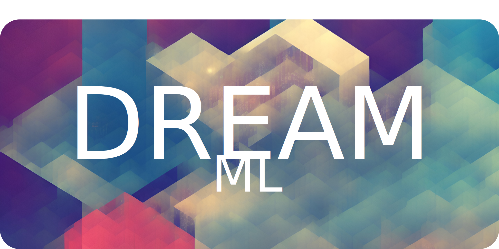

<h1 align="center">🌟 DREAM 🌟</h1>

## (Democratic Reinforcement Evolving AI Models)

We stand at a pivotal moment in history, where advanced AI models are set to reshape our world. DREAM is an ambitious initiative that envisions this powerful technology not as a resource reserved for the few but as a tool for widespread empowerment and collective advancement.
🌍

At its core, DREAM is dedicated to developing an open-source, continuously evolving AI language model, drawing inspiration from pioneering projects such as GPT-4 and LLaMa. Our vision emphasizes continuous learning and iterative improvements, driven by a diverse collective of contributors, leading to more versatile and effective AI solutions.

The process of crafting an AI system transcends mere technical hurdles; it signifies a novel engagement with our values, shared endeavours, and community aspirations. Acknowledging this, DREAM underscores the importance of value-alignment, tailoring AI systems to meet the unique needs of each user.

DREAM is committed to fostering a genuinely democratic AI training process. Our vision is to establish an innovative 'proof-of-work' mechanism that allows contributors to influence the AI's training data by contributing their computational resources. In this way, the AI's evolution mirrors the collective will of its contributors.

As part of our mission to democratize access to AI training, DREAM is focusing on creating an efficient infrastructure. We begin by optimizing algorithms for GPU acceleration, with plans to advance towards open-source Application-Specific Integrated Circuits (ASICs) designs for Ring Learning with Errors (RLWE), a crucial element in resilient cryptography. This innovation could significantly reduce the energy demands of computations within our envisioned network.

Embarking on the DREAM journey signifies not just pushing the boundaries of AI technology but also advocating for principles of diversity, autonomy, and creative expression. As Pierre Teilhard de Chardin famously said, "We are not human beings having a spiritual experience; we are spiritual beings having a human experience." In this spirit, we view our relationship with AI not just as creators and inventions but as teachers and learners, nurturing our AI systems as we would nurture our children.

We believe in the democratization of advanced AI, placing control in the hands of the masses, and fostering a network that surpasses the capabilities of any single entity. With DREAM, we strive to create an AI infrastructure that embodies the principle "with great power comes great responsibility." All network interactions are designed to be computationally reversible, allowing for the rectification of any actions by potential bad actors. The governance structure, determined by the computational contribution to the system, ensures a fair influence over its course.

While we expect the most popular fork of the DREAM architecture to remain open-source and free, DREAM's inherent flexibility allows for potential diversions. In such instances, only the modifications (delta values) would be proprietary, allowing the exclusion of these weights if necessary.

This flexible approach acknowledges the diverse range of transformations and structural deltas that can occur within a branching network, ensuring DREAM can accommodate myriad potential futures while staying true to its core principles.

We extend an open invitation for you to join us on this quest, contributing to a vision where technological progress benefits all of humanity. Together, we are creating a global tree of knowledge, a record of our shared wisdom encoded into blossoming forms of intelligence.
Join us in becoming good stewards of this powerful tool.

## 📚 Table of Contents
- [Project Goals](#-project-goals)
- [Project Beneficiaries](#-project-beneficiaries)
- [Project Timeline](#%EF%B8%8F-project-timeline)
    - [2023](#2023)
        - [Q2](#q2---june-to-august)
        - [Q3](#q3---september-to-november)
        - [Q4](#q4---december)
    - [2024](#2024)
        - [Q1](#q1---january-to-march)
- [Project Budget and Fundraising Goals](#-project-budget-and-fundraising-goals)
- [Risks and Challenges](#-risks-and-challenges)
- [Team and Organization](#-team-and-organization)
    - [Project Lead](#anthony-firn-project-lead)
    - [Open Positions](#open-positions)
    - [DREAM Community](#dream-community)
- [Engagement and Communication Plan](#-engagement-and-communication-plan)
- [Technical Roadmap](#%EF%B8%8F-technical-roadmap)
- [Governance Model](#%EF%B8%8F-governance-model)
- [Contributing](#-contributing)
- [Code of Conduct](#%EF%B8%8F-code-of-conduct)
- [License](#-license)

## 🎯 Project Goals
1.  **Short-Term Goals**:

    a. *Accelerated Algorithm Development*: Develop GPU-accelerated versions of all algorithms used for training, thus setting the foundation for an energy-efficient training model. This step is crucial for democratizing access to the AI training process and making it affordable for a wider population.

    b. *Community Building*: Cultivate an engaged, diverse, and inclusive community that contributes to the project by training, fine-tuning, and using the system. This includes developers, researchers, end-users, and more.

    c. *Pilot Launch*: Train and launch an initial version of the open-source language model. This preliminary version will serve as the basis for further improvements and fine-tuning by the community.

2.  **Medium-Term Goals**:

    a. *Cryptographic Revolution*: Improve and proliferate systems that seamlessly compute Ring Learning with Errors (RLWE), contributing to the evolution of post-quantum cryptography. This would advance the field of cryptography and make encrypted communications more secure.

    b. *Development of Specialized Hardware*: Begin development of an Application-Specific Integrated Circuit (ASIC) designed to accelerate RLWE computations. By enhancing the efficiency and reducing the cost of training the model, we can make the technology even more accessible.

    c. *Incremental Model Improvements*: Utilizing community feedback and collective computational power, make the first round of improvements and refinements to the open-source language model.

3.  **Long-Term Goals**:

    a. *Continual Evolution of Language Models*: Continually train, evolve, and fine-tune the language model through the efforts of a global, democratic community. Over time, the language model will become more sophisticated, nuanced, and effective in a wide range of applications.

    b. *Democratization of Advanced AI*: Democratize access to advanced AI technologies, empowering individuals and organizations around the world to utilize AI for their unique needs, thereby contributing to the overall well-being of conscious entities across the universe.

    c. *Establishment of Ethical AI Practices*: Encourage a new paradigm in AI development that is transparent, community-driven, and ethically aligned, challenging conventional models of AI ownership and development.

## 👥 Project Beneficiaries
1.  **Individual Users**: The direct beneficiaries would be individuals from all walks of life who have access to the platform. This could include students, researchers, hobbyists, and anyone interested in artificial intelligence, language models, or cryptography. They can use DREAM for various tasks, like question answering, writing, programming help, learning new topics, or anything that can be facilitated by a language model. The democratic fine-tuning aspect allows them to customize the AI according to their needs.

2.  **Educational Institutions**: Schools, colleges, and universities could benefit from an advanced, continually evolving language model. It could be used as a tool for teaching, for assisting in research, and for academic exploration in the field of AI.

3.  **Researchers and Developers**: AI researchers and developers can benefit from the open-source nature of DREAM. It allows them to study, contribute to, and build upon the advanced methodologies employed by DREAM.

4.  **Tech Companies**: Companies can use DREAM to improve their services, by integrating it into their applications, websites, and services. This could span industries from customer service (automated chatbots) to content creation (automated writing assistants).

5.  **Cryptography and Security Sector**: Given the post-quantum cryptographic element of the project, professionals and companies in the field of cybersecurity could benefit from DREAM. They could use the technology to develop more secure systems and to explore post-quantum cryptographic techniques.

6.  **Society at large**: DREAM could help democratize access to advanced AI technology. By making DREAM accessible to all, and by allowing democratic fine-tuning, the project can contribute to digital inclusion and empower people regardless of their technical background or financial capability.

7.  **Future Generations**: In the long run, DREAM could set a precedent for the democratic and inclusive development of AGI, contributing to a future where the benefits of advanced AI are shared widely rather than being concentrated in the hands of a few.

## 🗓️ Project Timeline

### 2023

#### Q2 - June to August

- Form the project team and secure initial funding.
- Build an initial community of developers, AI enthusiasts, and potential users.
- Begin researching viable blockchain structures and encryption methods for the project.

#### Q3 - September to November

- Develop accelerated algorithms for GPU-based model training.
- Design the blockchain-based system for tracking model versions and user contributions.
- Begin developing a lightweight, efficient system for homomorphic backpropagation.

#### Q4 - December

- Complete accelerated algorithm development.
- Launch the blockchain-based version control system.
- Start testing the homomorphic backpropagation system.

### 2024

#### Q1 - January to March

- Continue testing and refining the homomorphic backpropagation system.
- Begin planning for the RLWE system and ASIC design.
- Develop a system for integrating with IPFS or a similar distributed file system.

## 💰 Project Budget and Fundraising Goals

Our project budget is designed to ensure the sustainability of DREAM, allowing for the continual evolution and refinement of models. It also ensures the fair compensation of contributors and the establishment of efficient computational infrastructures. Here is an overview of our projected budget:

1. **Community Sourced Hardware** - $10,000: Budgeted for managing and coordinating the distributed network of GPUs provided by the community for model training.

2. **Development Tools & Services** - $20,000 per year: Budgeted for the various development tools and services needed for software development and project management.

3. **Team Salaries** - $500,000 per year: Budgeted for the salaries of key team members, who are crucial to the project's development, management, and growth.

4. **Contributor Compensation** - $300,000 per year: Budgeted for compensating community members for significant contributions to the project.

5. **Legal, Accounting, & Administrative** - $20,000 per year: Budgeted for various administrative expenses, including legal and accounting services.

6. **Marketing & Community Engagement** - $50,000 per year: Budgeted for activities to grow our user base and keep the community engaged.

In total, we are seeking to raise around $900,000 for the first year, and around $890,000 for subsequent years. This budget will support DREAM's mission to democratize advanced AI, provide secure cryptographic systems, and foster a community-driven approach to AGI development.

We are actively seeking funding through donations, grants, and sponsorships. All contributions, no matter how small, are immensely appreciated. They not only provide financial support but also demonstrate community engagement and shared belief in our mission.

To contribute to our project or learn more about our funding needs, please visit [link to funding page].

## 🚧 Risks and Challenges
Developing a democratic and evolving AI model is no small feat, and we anticipate several risks and challenges, including:

1. **Technical Complexity**: We are treading new territory and leveraging advanced technical concepts.
2. **Resource Availability**: Secure funding is pivotal for project success.
3. **Community Engagement**: The success of our project relies heavily on community contribution and engagement.
4. **Security Concerns**: With wide contributor influence, there's a risk of malicious manipulation.
5. **Governance Challenges**: Developing a governance structure aligning with democratic principles can be tricky.
6. **Legal and Ethical Considerations**: AI usage raises potential legal and ethical considerations.
7. **Long-Term Sustainability**: Ensuring the AI system's longevity as technology and user needs evolve.
8. **Scalability**: Efficiently scaling the technology as the project grows.

We recognize these risks and challenges and are committed to developing strategies to mitigate them. Transparency and accountability form the cornerstone of our approach, aligning with our democratic principles.

## 👨‍💻 Team and Organization

### Anthony Firn (Project Lead)

* GitHub: [@anthony-firn](https://github.com/anthony-firn)

Anthony Firn is the founder and lead developer of DREAM. Based in California, he is passionate about leveraging advanced AI technologies for the greater good of humanity. His deep understanding of language models, cryptography, and community engagement shapes the core mission of DREAM. He believes in the power of open source and community-driven initiatives and envisions a future where AGI is accessible and beneficial to all.

### Open Positions
DREAM is looking to expand its team and welcome passionate individuals who share our mission and goals. We believe that everyone has something unique to bring to the table and welcome a diversity of skills, backgrounds, and perspectives. If you believe in democratizing AI and want to contribute to the evolution of language models, we'd love to hear from you!

Open positions:

- Software Engineers (with a focus on AI and ML)
- Cryptography Specialists
- Community Engagement Managers
- Marketing and PR Specialists

Interested candidates are encouraged to reach out to us at anthonyfirn@illi.ac. Please include your resume and a brief introduction about your interest in DREAM and the role you're applying for.

### DREAM Community
DREAM's strength lies in its community. We are a collective of developers, researchers, enthusiasts, and end-users from all around the world. Our collective efforts drive the continual evolution of DREAM. We encourage everyone to contribute, no matter how small the contribution might seem. Every idea, every line of code, and every minute spent on DREAM brings us closer to our shared vision.

## 📣 Engagement and Communication Plan
Please refer to our [Engagement and Communication Plan](./docs/communication-plan.md) for more details.

## 🛠️ Technical Roadmap
Please refer to our [Technical Roadmap](./docs/techncial-roadmap.md) for more details.

## 🏛️ Governance Model
Please refer to our [Governance Model](./docs/governance-model.md) for more details.

## 🤝 Contributing
We would love for you to contribute to the evolution of DREAM! Please check out our [Contributing Guide](./docs/contributing-guide.md) for guidelines about how to proceed. Everyone is welcome to contribute, and we value every contribution.

## ⚖️ Code of Conduct
We want to ensure that our project is a welcoming and inclusive space for everyone. Please check out our [Code of Conduct](./docs/code-of-conduct.md) to understand our community norms and expectations.

## 📝 License
DREAM is released under the GPL-V3 license. See [LICENSE](./LICENSE) for more details.

---

🤝 **Thank you for joining us on this journey towards democratizing AGI. Your support means the world to us!** 🌏